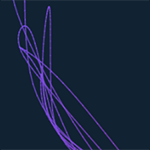

# Motus Art

Weekly moving art projects all created in JavaScript.  
Follow on [Instagram](https://www.instagram.com/owenmcateer/) or [Subscribe](http://eepurl.com/dmntwP) to my [newsletter](http://eepurl.com/dmntwP) to get email when new projects are added.

---

## Latest work

[**Week 3: Interlaced sun**][week03] [*(code)*][week03code]  
[][week03]

[**Week 2: Photoluminescent trail**][week02] [*(code)*][week02code]  
[][week02]

[**Week 1: Helix^2**][week01] [*(code)*][week01code]  
[][week01]

---

## About Motus Art

Motus is an art project of coded motion and animation. Motus Art was created by [Owen McAteer](https://owenmcateer.com/), a full stack web developer from Ireland who now lives in Madrid.
* [Newsletter](http://eepurl.com/dmntwP)
* [GitHub](https://github.com/owenmcateer)
* [Instagram](https://www.instagram.com/owenmcateer/)
* [Twitter](https://twitter.com/omcateer)

---

### License, share, learn

Feel free to edit, modify and learn from this [code](https://github.com/owenmcateer/Motus-Art) but please do credit a link back to this work. 
This project is licensed under the MIT License - see the [LICENSE](LICENSE) file for details.

[week01]: https://owenmcateer.github.io/Motus-Art/projects/week_01.html
[week01code]: https://github.com/owenmcateer/Motus-Art/tree/master/src/week_01
[week02]: https://owenmcateer.github.io/Motus-Art/projects/week_02.html
[week02code]: https://github.com/owenmcateer/Motus-Art/tree/master/src/week_02
[week03]: https://owenmcateer.github.io/Motus-Art/projects/week_03.html
[week03code]: https://github.com/owenmcateer/Motus-Art/tree/master/src/week_03
